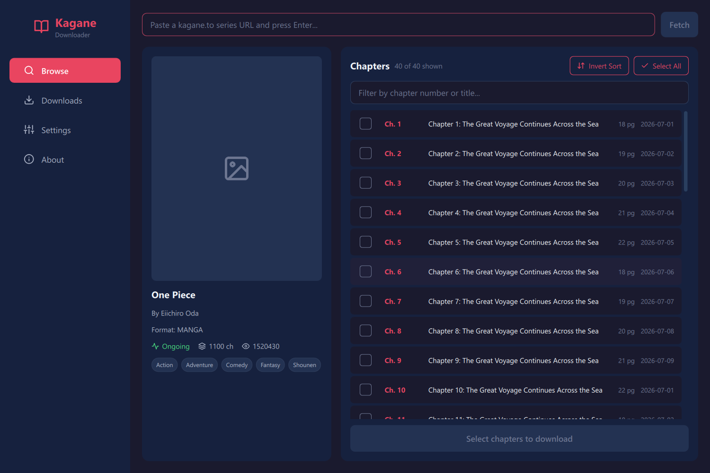

<p align="center">
  
</p>

<h1 align="center">🎴 Kagane Downloader</h1>

<p align="center">
  <b>A beautiful manga downloader for kagane.to</b>
</p>

<p align="center">
  
  
  
  <a href="https://github.com/Yui007/kagane-extension"></a>
</p>

---

> [!TIP]
> **Prefer a browser extension?**
> If you want a direct download method without setting up Python, check out the [Kagane Extension](https://github.com/Yui007/kagane-extension) to download manga chapters directly from your browser!

## ✨ Features

- 🖥️ **Modern Dark GUI** - PyQt6 + QML interface with chapter filtering and bulk selection
- ⚡ **Fast API Fetch** - Series metadata loads via the Kagane API in seconds
- 📄 **Multiple Formats** - Save as Images, PDF, or CBZ (with ComicInfo.xml metadata)
- 🔄 **Smart Retry** - Concurrent image downloads with automatic retry
- 🚀 **Headless Mode** - Keep the helper browser window hidden
- 💻 **CLI Support** - Full-featured command line interface

## 🚀 Installation

### Windows executable (recommended)

Download `KaganeDownloader.exe` from [Releases](https://github.com/thissaksham/kagane-downloader/releases) and run it — no Python setup required. Google Chrome must be installed. Settings and downloads are stored next to the exe.

### From source

```bash
# Clone the repository
git clone https://github.com/Yui007/kagane-downloader.git
cd kagane-downloader

# Install dependencies
pip install -r requirements.txt
```

## 📖 Usage

### GUI Mode (Recommended)
```bash
python gui/main.py
```

Paste a series URL, press Enter, pick your chapters (the filter box helps with long series), and hit Download.

### CLI Mode
```bash
python main.py
```

### Series info without downloading
```bash
python main.py info "https://kagane.to/series/..."
```

## ⚙️ Configuration

Settings are saved to `config.json` (created on first run) and editable from both the GUI and CLI.

| Setting | Description | Default |
|---------|-------------|---------|
| `download_format` | Output format (images/pdf/cbz) | `cbz` |
| `keep_images` | Keep images after PDF/CBZ conversion | `false` |
| `max_concurrent_images` | Parallel image downloads per chapter | `10` |
| `image_load_delay` | Fallback wait for pages to load (seconds) | `60` |
| `max_retries` | Retry attempts for failed images | `5` |
| `download_directory` | Where to save downloads | `downloads` |
| `headless_mode` | Hide the helper browser window (may fail Cloudflare checks) | `false` |
| `use_legacy_headless` | Use the older headless engine | `false` |
| `enable_logs` | Verbose logging | `false` |

## 🔨 Building the exe

```bash
pip install pyinstaller
python -m PyInstaller --noconfirm --onefile --windowed --name KaganeDownloader --icon icon.ico --paths . --add-data "gui/qml;qml" --add-data "icon.ico;." --hidden-import PyQt6.QtQuick gui/main.py
```

The exe lands in `dist/`.

## 📁 Project Structure

```
kagane-downloader/
├── gui/                    # PyQt6 + QML GUI
│   ├── main.py            # GUI entry point
│   ├── backend/           # Python workers
│   └── qml/               # QML UI files
├── src/
│   ├── scraper/           # API client & chapter downloading
│   ├── converter/         # PDF & CBZ conversion
│   └── utils/             # Helper utilities
├── main.py                # CLI entry point
└── config.py              # Configuration management
```

## 🛠️ Requirements

- Python 3.10+ (or just the exe)
- Chrome/Chromium browser
- Dependencies: `undetected-chromedriver`, `PyQt6`, `typer`, `rich`, `pillow`, `img2pdf`, `curl_cffi`

## 📝 License

MIT License - feel free to use and modify!

---

<p align="center">
  Made with ❤️ for manga lovers
</p>
